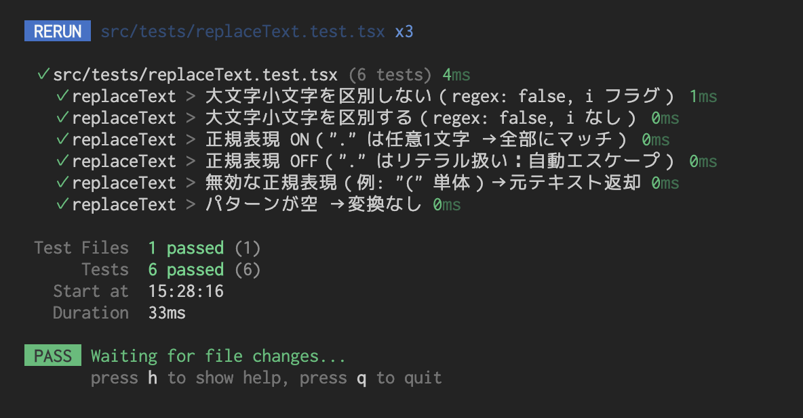
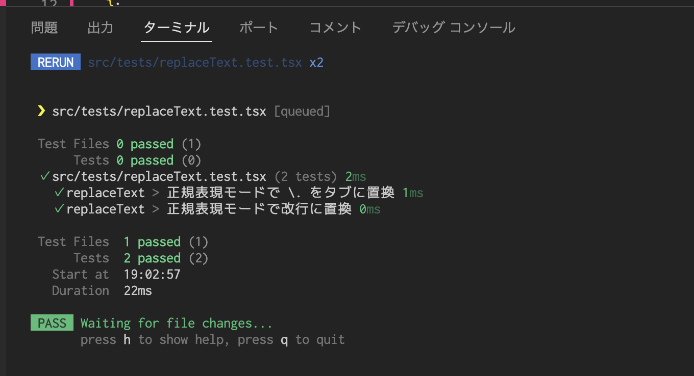

# React Text Tool

React + TypeScript で作成したテキスト操作ツールです。  
テキストの置換、JSON 整形、CSV 変換などを簡単に行えます。  
ポートフォリオ兼、オープンソースの学習用プロジェクトです。

---

## ✨ 機能

- テキスト置換（正規表現 ON/OFF、大文字小文字区別）
- プレビュー表示（Before / After 差分）
- JSON 整形（インデント幅切替）
- JSON → CSV 変換
- 出力コピー機能
- レスポンシブ対応

---

## 🛠 開発環境

- Node.js: 20.x (LTS)
- npm: 10.x
- React: 18.x
- TypeScript: 5.x
- Vite: 5.x

---

## 🧪 テスト結果

replaceText のテスト結果

---

## 📜 License

MIT License
